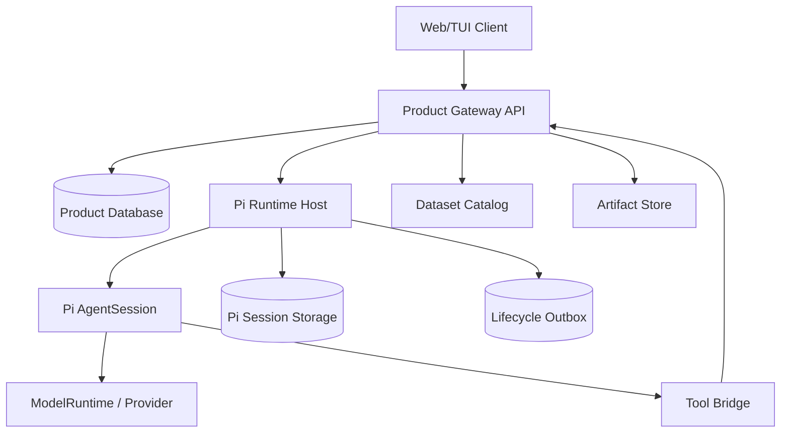

# 完整项目手册：基于 Pi 的数据准备 Agent

> 本手册的目标不是再做一个 Toy Chatbot，而是让你从零完成一套可恢复、可审批、可观测、可面试展示的 Agent 应用。

## 1. 最终产品

用户用自然语言描述：

```text
区域
时间范围
变量
分辨率
权威来源偏好
误差要求
输出格式
```

系统完成：

```mermaid
flowchart LR
    R[需求结构化] --> S[Catalog Search]
    S --> I[Inspect Metadata]
    I --> Q[Coverage/Quality Compare]
    Q --> C[Recommendation]
    C --> P[Immutable Download Plan]
    P --> A[Approval]
    A --> E[Idempotent Execute]
    E --> V[Checksum/Validation]
    V --> O[Experiment Report]
```



## 2. 为什么这个项目适合学习 Pi

它同时包含：

- 多 Turn Tool Loop；
- Steer 与 Follow-up；
- 只读和写 Tool；
- Approval；
- Idempotency；
- Unknown Outcome；
- Session/Fork；
- Compaction；
- Product Memory；
- Runtime Host；
- Event Reducer；
- 长时间任务；
- 可复现产物。

比“查询天气 Agent”更能证明你理解 Runtime，而不仅会写 Prompt。

## 3. 项目架构



### 权威状态

| 状态 | 权威拥有者 |
|---|---|
| Run/Turn/Tool Loop | Pi |
| Transcript/Compaction/Fork | Pi Session |
| 用户/项目/需求 | Product DB |
| Dataset Metadata | Product Catalog |
| Approval | Product DB |
| Download Attempt | Product DB |
| Artifact/Checksum | Artifact Store + Product DB |
| UI Working State | Runtime Event Projection，可由 Snapshot 校正 |
| Memory/Knowledge | Product Memory Store |

## 4. 手册目录

| 章节 | 产出 |
|---|---|
| [01 需求、边界与验收](01-requirements-boundaries.md) | 冻结 MVP、非目标、所有权和验收 |
| [02 领域与持久化数据模型](02-domain-session-data-model.md) | Catalog、Plan、Approval、Attempt、Artifact、Session Binding 表 |
| [03 协议、身份与幂等](03-protocol-idempotency.md) | Request/Turn/Tool/Event Identity、Outbox、状态机 |
| [04 实施计划与代码路径](04-implementation-plan.md) | 7 个里程碑、目录、接口、每阶段退出条件 |
| [05 测试与故障矩阵](05-test-failure-matrix.md) | 正常、并发、取消、Crash、恢复和安全测试 |
| [06 调试 Playbook](06-debugging-playbook.md) | 从症状到权威证据和源码入口 |
| [07 Demo、README 与面试表达](07-demo-and-interview.md) | 五分钟 Demo、90 秒讲解、项目 README 结构 |

## 5. 七个里程碑


### M0：领域和 Fixture

不接模型。完成数据集模型、Requirement、Catalog、Coverage、Quality Evidence 和纯函数测试。

### M1：只读 Tool

实现 Search/Inspect/Compare，Tool 测试全绿。

### M2：Pi AgentSession

Faux Provider 跑通 Tool Loop，再接真实模型。完成 Event Trace。

### M3：Plan 与 Approval

不可变 Download Plan、Digest、Approval Token、Act Gate。

### M4：执行与恢复

Idempotent Attempt、Checksum、Crash Point、Unknown Outcome。

### M5：Host 与 UI

协议、Session Pool、Event Reducer、Snapshot、Abort、多 Session。

### M6：长任务与交付

Compaction、Fork、Memory、Outbox、完整 Demo、文档和面试表达。

## 6. 每个里程碑的退出门

不能以“代码写完”作为退出。必须同时有：

```text
行为测试
失败注入
状态/事件证据
数据持久化证据
用户可见结果
文档解释
```

示例 M4：

```text
✓ 未审批绝不写文件
✓ 同 Idempotency Key 只写一次
✓ Effect 后 Crash 可核验恢复
✓ Checksum 不匹配进入 Failed
✓ Abort 不开启后续 Item
✓ Host Restart 后继续/停止有明确状态
✓ Tool Result 和 Product DB 一致
```

## 7. 推荐学习周期

| 周 | 内容 | 产出 |
|---|---|---|
| 1 | 00–05 导读 + 深挖 01–03 | Faux Tool Loop、事件 Trace |
| 2 | 深挖 04–06 + 实验 03/04 | Session/Compaction/Auth 实验 |
| 3 | 深挖 07–09 + 实验 05 | Extension/Host/UI Client |
| 4 | 项目 M0–M2 | 只读 Agent Demo |
| 5 | 项目 M3–M4 | Approval/Execution/Recovery |
| 6 | 项目 M5–M6 | UI、长任务、文档、面试 Demo |

时间不是验收标准；某周内容未达到退出门就不进入下一里程碑。

## 8. 不允许的捷径

- 用 Prompt 代替权限；
- Tool 直接写文件但无 Attempt；
- 用聊天文本保存 Approval；
- Client 通过最后 Token 猜 Settled；
- Product Backend 直接修改 Pi JSONL；
- Retry 重放无幂等副作用；
- Compaction Summary 只写聊天主题；
- Fork 继承源 Approval；
- Runtime Host 单请求超时直接退出进程；
- 只跑 Happy Path 后宣称“支持恢复”。

## 9. 最终仓库应能展示的证据

```text
docs/
├── ARCHITECTURE.md
├── REQUIREMENTS.md
├── STATE_MACHINES.md
├── FAILURE_MATRIX.md
├── RUNTIME_EVIDENCE.md
└── DEMO.md

reports/
├── event-trace.jsonl
├── recovery-cases.json
├── test-results.md
└── sample-report.md
```

项目 README 首页应能回答：

- 用户问题是什么；
- 为什么需要 Agent；
- Pi 与产品各负责什么；
- 一条真实请求怎样运行；
- 如何保证副作用、取消和恢复；
- 结果和测试证据是什么；
- 当前限制是什么。

## 10. 完成定义

你只有在能独立完成以下解释时才算结课：

1. 从 `createAgentSession()` 讲到 Tool Result 回流；
2. 解释 `agent_end`、Retry、Compaction 和 `agent_settled`；
3. 手工还原一个 Forked Session Branch；
4. 解释写 Tool 的 Intent/Effect/Settlement；
5. 演示一个 Crash 后恢复且不重复执行；
6. 演示 Steer、Abort、Compaction、Fork；
7. 展示 Event Reducer 防止 Late Event；
8. 明确 Room/Memory/Approval 为什么不属于 Pi Core；
9. 用 90 秒讲清项目价值和最难工程问题；
10. 面对源码追问能指出具体文件和函数链。
