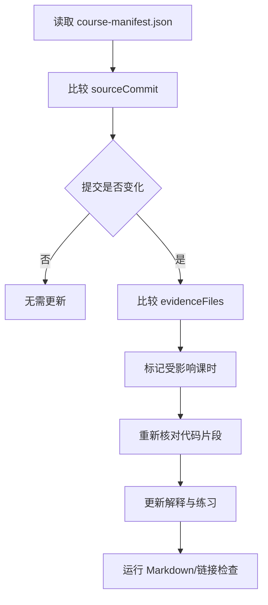

# 源码基线与证据清单

## 为什么必须固定基线

Pi 正在快速演进。只记“某个函数大概在某一行”很容易失效，因此课程采用：

```text
提交级基线
+ 文件路径
+ 文件 Blob SHA
+ 机制级解释
```

课程引用的行号只用于当前阅读，不作为长期事实。长期事实是职责、调用关系和状态变化。

## 基线提交

| 范围 | 提交 |
|---|---|
| `7155/pi` 集成基线 | `1cafa4567357ba6d211033e99f58c19385ccacf1` |
| 上游 Pi 0.84.2 | `59a71b235dadb4ad0d67557a8abb0aaa093e68b4` |

## 主要证据文件

| 文件 | 当前 Blob SHA | 课程用途 |
|---|---|---|
| `packages/agent/src/agent.ts` | `dfd4f93915e8da93ae1d6b46f153c0bdc5782c64` | Agent 状态、Run、队列、事件 settlement |
| `packages/agent/src/agent-loop.ts` | `1f9d44599a268d184897fa6462e1fbdf895303f7` | Turn、模型流、Tool Loop、并行工具 |
| `packages/agent/src/types.ts` | `5b20b21f4ea0bc6e6d54fb2c27e57b87037e8c24` | Agent/Tool/事件公共契约 |
| `packages/coding-agent/src/core/sdk.ts` | `a9a26641868926f775f06f3cfdac1b775e42a62f` | `createAgentSession()` 装配入口 |
| `packages/coding-agent/src/core/agent-session.ts` | `4d02d194381138dce2c13cf5a57466014198e4b5` | 持久化、扩展、重试、压缩与最终 settlement |
| `packages/coding-agent/src/core/agent-session-runtime.ts` | `c3b60569e7cad7b94f47bcfdf60e14c824dd62b1` | Session 替换、Fork、恢复和旧资源失效 |
| `packages/coding-agent/src/core/session-manager.ts` | `cd9d2f437ae4cb81e41f7b5d9f78803cecdf89dd` | JSONL、树结构、Entry 与 Context 投影 |
| `packages/coding-agent/src/core/compaction/compaction.ts` | `a2a1c063f1b76c447530ee3449b07a060e440a9f` | 压缩阈值、切点和摘要 |
| `packages/coding-agent/src/core/model-runtime.ts` | `6f4071b60b3bf6ab58d6174d38b090f62dc6dbce` | 模型目录、Provider、鉴权和可用性 |
| `packages/coding-agent/src/core/resource-loader.ts` | `c24d0a2104771064015e149ebd5894f83dc102bd` | Extension、Skill、Prompt、Theme 和上下文文件 |
| `packages/coding-agent/src/core/extensions/types.ts` | `9008d62124073e0cd77efde7e46bbe76a7db8da7` | Extension 事件与 UI 契约 |
| `packages/tui/src/tui.ts` | `5172a9a142c582f8d8ad9c8c85772f1b093cc5a7` | 差分渲染、焦点和输入 |
| `packages/agent/src/harness/agent-harness.ts` | `3802900db7170020e5d09eecbec1c0691e9c390c` | Durable Harness、Lane 与当前未完成边界 |
| `integrations/rag-ime-runtime-host/README.md` | `7fa936e281b9fc91102529fe89dafd88431ce0f6` | 产品 Runtime 的职责边界与协议 |
| `integrations/rag-ime-runtime-host/src/jsonl-framing.ts` | `649d0bea463431a42e0e355a6a24df254585ec2c` | 严格 JSONL 字节边界与 UTF-8 校验 |
| `integrations/rag-ime-runtime-host/src/request-dispatcher.ts` | `833f61fc9df8d7dcc0b6b6cf3c649c1d81019172` | 并发控制面分发与请求级错误隔离 |
| `integrations/rag-ime-runtime-host/src/runtime-baseline.ts` | `393594cdc92950ddf2bea3b1f243548f82304364` | 对外 Runtime 基线元数据归一化 |

## 更新课程时怎么做



更新原则：

- 源码改名但机制没变：更新路径和代码片段，不重写整课。
- 事件顺序、状态所有权或失败语义改变：必须重写对应机制图和练习题。
- 实验接口变成稳定接口：去掉“当前未完成”警示，并补真实测试证据。
- 产品适配器改变：只改第 12、13 课，除非它反向修改了 Pi 核心。
